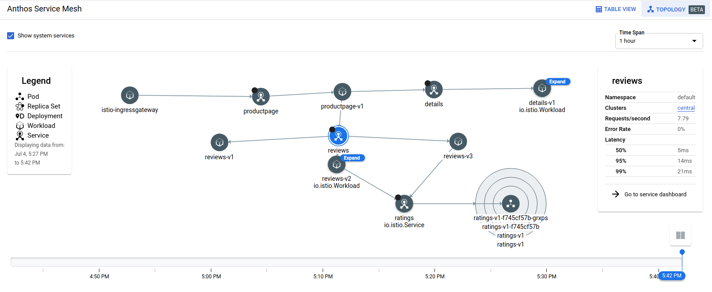
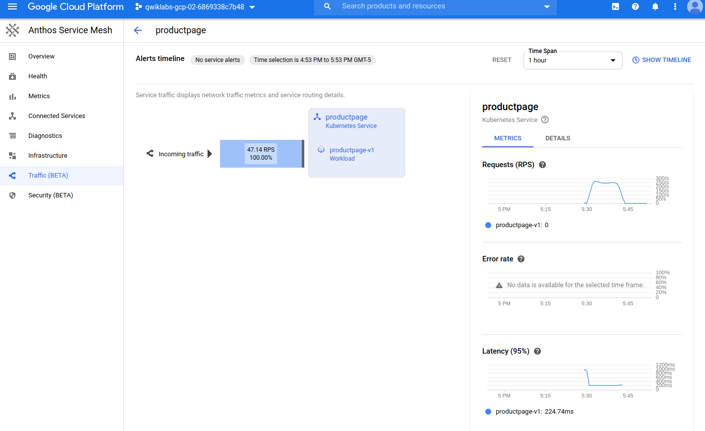

## Anthos Service Mesh



#### Enable required APIs
```
gcloud services enable \
    container.googleapis.com \
    compute.googleapis.com \
    stackdriver.googleapis.com \
    meshca.googleapis.com \
    meshtelemetry.googleapis.com \
    meshconfig.googleapis.com \
    iamcredentials.googleapis.com \
    anthos.googleapis.com \
    gkeconnect.googleapis.com \
    gkehub.googleapis.com \
    cloudresourcemanager.googleapis.com
```

#### Configure environment variables
```
export PROJECT_ID=$(gcloud config get-value project)
export PROJECT_NUMBER=$(gcloud projects describe ${PROJECT_ID} \
    --format="value(projectNumber)")
export CLUSTER_NAME=central
export CLUSTER_ZONE=us-central1-b
export WORKLOAD_POOL=${PROJECT_ID}.svc.id.goog
export MESH_ID="proj-${PROJECT_NUMBER}"
```

- WORKLOAD_POOL will be used to enable Workload Identity, which is the recommended way to safely access Google Cloud services from GKE applications.
- MESH_ID will be used to set the mesh_id label on the cluster, which is required for metrics to get displayed on the Anthos Service Mesh Dashboard in the Cloud Console.

#### Check that user has owner role
```
student_02_b0ce51188ea3@cloudshell:~ (qwiklabs-gcp-02-6869338c7b48)$ gcloud projects get-iam-policy $PROJECT_ID \
>     --flatten="bindings[].members" \
>     --filter="bindings.members:user:$(gcloud config get-value core/account 2>/dev/null)"
---
bindings:
  members: user:student-02-b0ce51188ea3@qwiklabs.net
  role: roles/owner
etag: BwWppNQHb_A=
version: 1
---
bindings:
  members: user:student-02-b0ce51188ea3@qwiklabs.net
  role: roles/viewer
etag: BwWppNQHb_A=
version: 1
```

To complete setup, you need the permissions associated with these roles:
Project Editor
Kubernetes Engine Admin
Project IAM Admin
GKE Hub Admin
Service Account Admin
Service Account key Admin
If you have the Owner role, you have all these permissions and more, so you're ready to proceed.


#### Create GKE cluster
```
gcloud config set compute/zone ${CLUSTER_ZONE}
gcloud beta container clusters create ${CLUSTER_NAME} \
    --machine-type=n1-standard-4 \
    --num-nodes=4 \
    --workload-pool=${WORKLOAD_POOL} \
    --enable-stackdriver-kubernetes \
    --subnetwork=default \
    --labels mesh_id=${MESH_ID}
```

#### Register for Connect for Anthos

Connect for Anthos allows you to register any of your Kubernetes clusters to Google Cloud, even clusters running on-premises or on other cloud providers. This enables access to cluster and workload management features in Cloud Console, including a unified user interface to interact with your clusters.

#### Check for cluster-admin access
```
student_02_b0ce51188ea3@cloudshell:~ (qwiklabs-gcp-02-6869338c7b48)$ kubectl auth can-i '*' '*' --all-namespaces
yes
student_02_b0ce51188ea3@cloudshell:~ (qwiklabs-gcp-02-6869338c7b48)$
```

#### Create service account for GKE Connect
```
gcloud iam service-accounts create connect-sa
```

#### Assign gkehub.connect role
```
gcloud projects add-iam-policy-binding ${PROJECT_ID} \
 --member="serviceAccount:connect-sa@${PROJECT_ID}.iam.gserviceaccount.com" \
 --role="roles/gkehub.connect"
 ```

 #### Create and download service account key
 ```
 gcloud iam service-accounts keys create connect-sa-key.json \
  --iam-account=connect-sa@${PROJECT_ID}.iam.gserviceaccount.com
```

#### Use the key and register the cluster
```
  gcloud container hub memberships register ${CLUSTER_NAME}-connect \
   --gke-cluster=${CLUSTER_ZONE}/${CLUSTER_NAME}  \
   --service-account-key-file=./connect-sa-key.json
kubeconfig entry generated for central.
Waiting for membership to be created...done.
Created a new membership [projects/qwiklabs-gcp-02-6869338c7b48/locations/global/memberships/central-connect] for the cluster [central-connect]
Generating the Connect Agent manifest...
Deploying the Connect Agent on cluster [central-connect] in namespace [gke-connect]...
Deployed the Connect Agent on cluster [central-connect] in namespace [gke-connect].
Finished registering the cluster [central-connect] with the Hub.
student_02_b0ce51188ea3@cloudshell:~ (qwiklabs-gcp-02-6869338c7b48)$

```


#### Initialize project for Anthos installation
```
curl --request POST \
  --header "Authorization: Bearer $(gcloud auth print-access-token)" \
  --data '' \
  https://meshconfig.googleapis.com/v1alpha1/projects/${PROJECT_ID}:initialize
```

#### Download the installation file
```
curl -LO https://storage.googleapis.com/gke-release/asm/istio-1.4.7-asm.0-linux.tar.gz
curl -LO https://storage.googleapis.com/gke-release/asm/istio-1.4.7-asm.0-linux.tar.gz.1.sig
openssl dgst -verify - -signature istio-1.4.7-asm.0-linux.tar.gz.1.sig istio-1.4.7-asm.0-linux.tar.gz <<'EOF'
-----BEGIN PUBLIC KEY-----
MFkwEwYHKoZIzj0CAQYIKoZIzj0DAQcDQgAEWZrGCUaJJr1H8a36sG4UUoXvlXvZ
wQfk16sxprI2gOJ2vFFggdq3ixF2h4qNBt0kI7ciDhgpwS8t+/960IsIgw==
-----END PUBLIC KEY-----
EOF 
```

#### Install Anthos
```
tar xzf istio-1.4.7-asm.0-linux.tar.gz
cd istio-1.4.7-asm.0
export PATH=$PWD/bin:$PATH
istioctl manifest apply --set profile=asm \
  --set values.global.trustDomain=${WORKLOAD_POOL} \
  --set values.global.sds.token.aud=${WORKLOAD_POOL} \
  --set values.nodeagent.env.GKE_CLUSTER_URL=https://container.googleapis.com/v1/projects/${PROJECT_ID}/locations/${CLUSTER_ZONE}/clusters/${CLUSTER_NAME} \
  --set values.global.meshID=${MESH_ID} \
  --set values.global.proxy.env.GCP_METADATA="${PROJECT_ID}|${PROJECT_NUMBER}|${CLUSTER_NAME}|${CLUSTER_ZONE}"
- Applying manifest for component Base...
✔ Finished applying manifest for component Base.
- Applying manifest for component IngressGateway...
- Applying manifest for component Galley...
- Applying manifest for component Injector...
- Applying manifest for component NodeAgent...
- Applying manifest for component Pilot...
✔ Finished applying manifest for component NodeAgent.
✔ Finished applying manifest for component Injector.
✔ Finished applying manifest for component Galley.
✔ Finished applying manifest for component IngressGateway.
✔ Finished applying manifest for component Pilot.
✔ Installation complete

```

#### Validate installation
```
asmctl validate --with-testing-workloads
Using Kubernetes context: qwiklabs-gcp-02-6869338c7b48_us-central1-b_central
To change the context, use the --context flag
Validating enabled APIs
OK
Validating Node-Agent configuration
OK
Validating Istio system
OK
Validating issued certs
OK
Validating sample traffic
Launching example services...
Sent traffic to example service http code: 200
verified mTLS configuration
OK
```

#### Enable sidecar injection and install samples
```
kubectl label namespace default istio-injection=enabled --overwrite
kubectl apply -f samples/bookinfo/platform/kube/bookinfo.yaml
kubectl apply -f samples/bookinfo/networking/bookinfo-gateway.yaml

```


