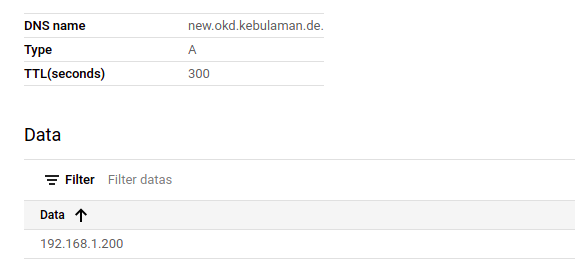

# Steps to deploy OKD on a GCP project

## Point to the GCP project (e.g. my-okd-10012021)
```
gcloud config set project my-okd-10012021
```

## Enable all the required APIs
```
gcloud services enable compute.googleapis.com
gcloud services enable cloudapis.googleapis.com
gcloud services enable cloudresourcemanager.googleapis.com
gcloud services enable dns.googleapis.com
gcloud services enable iamcredentials.googleapis.com
gcloud services enable iam.googleapis.com
gcloud services enable servicemanagement.googleapis.com
gcloud services enable serviceusage.googleapis.com
gcloud services enable storage-api.googleapis.com
gcloud services enable storage-component.googleapis.com
```

## Increase project quota for persistent disk and number of CPU
- increase persistent disk quota to 2000 GB
- increase max number of CPU to 40

## Create a public zone using Google Cloud DNS (e.g. okd.kebulaman.de)


## get the list of nameservers to be used from that new public zone
```
gcloud dns managed-zones describe my-okd-zone
```

## create NS record for the subdomain (okd.kebulaman.de based on the list of nameservers provided by the previous command) in the Google Domain site


## validate by creating an A record and do an nslookup

```
nslookup new.okd.kebulaman.de
Server:         127.0.0.53
Address:        127.0.0.53#53

Non-authoritative answer:
Name:   new.okd.kebulaman.de
Address: 192.168.1.200

```

## create a service account for installation, give it appropriate role - owner for now
```
gcloud iam service-accounts create okd-cluster-sa
gcloud projects add-iam-policy-binding my-okd-10012021 --member="serviceAccount:okd-cluster-sa@my-okd-10012021.iam.gserviceaccount.com" --role="roles/owner"
```

## generate private key for the service account and download it as JSON file

## generate ssh keypair
```
ssh-keygen -t ed25519 -N '' -f ~/.ssh/okd_id
eval "$(ssh-agent -s)"
ssh-add ~/.ssh/okd_id
```

## not sure if this step is needed
```
export GOOGLE_APPLICATION_CREDENTIALS="<path-to-json-file-of-the-service-account-private-key>" 
```

## use the service account private key to authenticate
```
gcloud auth activate-service-account --project=my-okd-10012021 --key-file=<path-to-json-file-of-the-service-account-private-key>
gcloud auth list
../openshift-install create cluster --dir=. --log-level=debug
```

## Takes about 46 minutes to install

## Download oc client CLI and configure the kubeconfig to point to the proper config
```
export KUBECONFIG=<path-to-okd-kubeconfig-under-auth-folder>
```

## Try it out by creating a new project and deploy a sample app
```
oc new-project ape
oc apply -f gorilla.yml
oc get po
oc get svc
oc expose svc gorilla-v1
oc get route
curl http://gorilla-v1-ape.apps.okdcentral1.okd.kebulaman.de/greeting
```

## When you're done, destroy the cluster to prevent charges
```
../openshift-install destroy cluster --dir=. --log-level=debug
```
