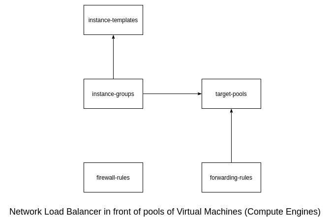
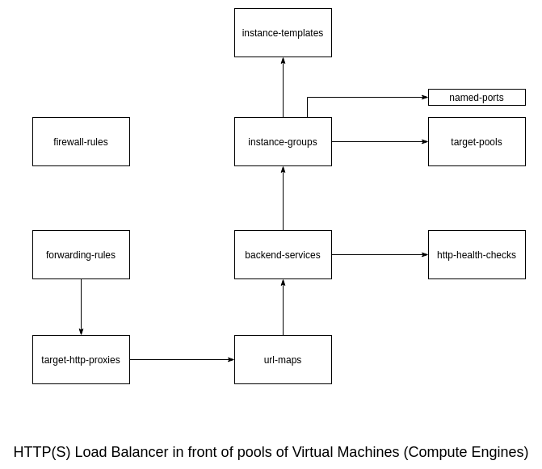

# Notes on GCP

## Basic commands

#### List active account names
```
gcloud auth list
```

#### List project ID
```
gcloud config list project
```

#### Getting details about your project
```
gcloud compute project-info describe --project <your_project_ID>
```

#### Set default zone / region
```
gcloud config set compute/zone us-central1-a
gcloud config set compute/region us-central1
```

#### Getting verbose help on a given command
```
gcloud config --help
```

#### Getting a list of configs
```
gcloud config list
```

#### Getting component list
```
gcloud components list
```

## Compute Engine

#### Create a virtual machine
```
gcloud compute instances create gcelab2 --machine-type n1-standard-2 --zone us-central1-c
```

#### Getting details about a given VM
```
gcloud compute instances describe <your_vm>
```

#### SSH into a virtual machine
```
gcloud compute ssh gcelab2 --zone us-central1-c
```

#### Sample startup script
```
cat << EOF > startup.sh
#! /bin/bash
apt-get update
apt-get install -y nginx
service nginx start
sed -i -- 's/nginx/Google Cloud Platform - '"\$HOSTNAME"'/' /var/www/html/index.nginx-debian.html
EOF
```

#### Create an instance template
```
gcloud compute instance-templates create nginx-template \
         --metadata-from-file startup-script=startup.sh
```

#### Create a target pool
```
gcloud compute target-pools create nginx-pool
```

#### Create a managed instance group
```
gcloud compute instance-groups managed create nginx-group \
         --base-instance-name nginx \
         --size 2 \
         --template nginx-template \
         --target-pool nginx-pool
```

#### List compute engine instances
```
gcloud compute instances list
```

#### Create a firewall rules
```
gcloud compute firewall-rules create www-firewall --allow tcp:80
```

## Google Kubernetes Engine (GKE)

##### Create a new cluster
```
gcloud container clusters create [CLUSTER-NAME]
```

#### Get authentication credential
```
gcloud container clusters get-credentials [CLUSTER-NAME]
```

#### Create a simple deployment
```
kubectl create deployment hello-server --image=gcr.io/google-samples/hello-app:1.0
```

#### Create a service with LoadBalancer type
```
kubectl expose deployment hello-server --type=LoadBalancer --port 8080
```

## Network Load Balancer



#### Create L3 Network Load Balancer
```
gcloud compute forwarding-rules create nginx-lb \
         --region us-central1 \
         --ports=80 \
         --target-pool nginx-pool
```

#### List all forwarding rules
```
gcloud compute forwarding-rules list
```

## HTTP(S) Load Balancer



#### Create a health check
```
gcloud compute http-health-checks create http-basic-check
```

#### Define an HTTP service and map port 80 to instance group
```
gcloud compute instance-groups managed \
       set-named-ports nginx-group \
       --named-ports http:80
```

#### Create a backend service
```
gcloud compute backend-services create nginx-backend \
      --protocol HTTP --http-health-checks http-basic-check --global
```

#### Add instance group to backend service
```
gcloud compute backend-services add-backend nginx-backend \
    --instance-group nginx-group \
    --instance-group-zone us-central1-a \
    --global
```

#### Create a default URL map to redirect traffic
```
gcloud compute url-maps create web-map \
    --default-service nginx-backend
```

#### Create a target HTTP proxy to route requests to your URL map
```
gcloud compute target-http-proxies create http-lb-proxy \
    --url-map web-map
```

#### Create a global forwarding rule to handle and route incoming requests. 
```
gcloud compute forwarding-rules create http-content-rule \
        --global \
        --target-http-proxy http-lb-proxy \
        --ports 80
```

#### Get the IP_ADDRESS for load balancing
```
gcloud compute forwarding-rules list
```

## Other example
```
gcloud config set compute/region us-east1

gcloud compute instances create nucleus-jumphost --machine-type f1-micro --zone us-east1-b

gcloud container clusters create nucleus-gke --region=us-east1 --num-nodes=1

kubectl create deployment nucleus-hello-app --image=gcr.io/google-samples/hello-app:2.0

kubectl expose deployment nucleus-hello-app --type=LoadBalancer --port 8080

cat << EOF > startup.sh
> #! /bin/bash
> apt-get update
> apt-get install -y nginx
> service nginx start
> sed -i -- 's/nginx/Google Cloud Platform - '"\$HOSTNAME"'/' /var/www/html/index.nginx-debian.html
> EOF

gcloud compute instance-templates create nucleus-nginx-template --metadata-from-file startup-script=startup.sh

gcloud compute target-pools create nucleus-nginx-target-pool

gcloud config set compute/zone us-east1-b

gcloud compute instance-groups managed create nucleus-nginx-group --base-instance-name nucleus-nginx --size 2 --template nucleus-nginx-template --target-pool nucleus-nginx-tar
get-pool

gcloud compute instance-groups managed set-named-ports nucleus-nginx-group --named-ports http:80

gcloud compute instances list

gcloud compute firewall-rules create www-firewall --allow tcp:80

gcloud compute http-health-checks create nucleus-nginx-healthcheck

gcloud compute backend-services create nucleus-nginx-backend --protocol HTTP --http-health-checks nucleus-nginx-healthcheck --global

gcloud compute backend-services add-backend nucleus-nginx-backend --instance-group nucleus-nginx-group --instance-group-zone us-east1-b --global

gcloud compute url-maps create nucleus-nginx-map --default-service nucleus-nginx-backend

gcloud compute target-http-proxies create nucleus-http-lb --url-map nucleus-nginx-map

gcloud compute forwarding-rules create nucleus-http-lb-rule --global --target-http-proxy nucleus-http-lb --ports 80

gcloud compute forwarding-rules list

----------------

student_00_73662fea9419@cloudshell:~ (qwiklabs-gcp-00-a119b519f9cb)$ gcloud compute instance-groups list
NAME                                       LOCATION    SCOPE  NETWORK  MANAGED  INSTANCES
gke-nucleus-gke-default-pool-d22181ec-grp  us-east1-b  zone   default  Yes      1
nucleus-nginx-group                        us-east1-b  zone   default  Yes      2
gke-nucleus-gke-default-pool-16c1015e-grp  us-east1-c  zone   default  Yes      1
gke-nucleus-gke-default-pool-53b6c70e-grp  us-east1-d  zone   default  Yes      1


student_00_73662fea9419@cloudshell:~ (qwiklabs-gcp-00-a119b519f9cb)$ gcloud compute forwarding-rules list
NAME                              REGION    IP_ADDRESS     IP_PROTOCOL  TARGET
nucleus-http-lb-rule                        34.120.229.91  TCP          nucleus-http-lb
a8317880eadd611eab91c42010a8e000  us-east1  34.75.77.128   TCP          us-east1/targetPools/a8317880eadd611eab91c42010a8e000
student_00_73662fea9419@cloudshell:~ (qwiklabs-gcp-00-a119b519f9cb)$


student_00_73662fea9419@cloudshell:~ (qwiklabs-gcp-00-a119b519f9cb)$ gcloud compute instances list
NAME                                        ZONE        MACHINE_TYPE   PREEMPTIBLE  INTERNAL_IP  EXTERNAL_IP     STATUS
gke-nucleus-gke-default-pool-d22181ec-4chb  us-east1-b  n1-standard-1               10.142.0.4   35.243.227.208  RUNNING
nucleus-jumphost                            us-east1-b  f1-micro                    10.142.0.2   34.73.162.206   RUNNING
nucleus-nginx-4w3b                          us-east1-b  n1-standard-1               10.142.0.7   35.227.8.67     RUNNING
nucleus-nginx-6wtz                          us-east1-b  n1-standard-1               10.142.0.6   34.75.187.39    RUNNING
gke-nucleus-gke-default-pool-16c1015e-xldc  us-east1-c  n1-standard-1               10.142.0.5   35.243.180.79   RUNNING
gke-nucleus-gke-default-pool-53b6c70e-5rrw  us-east1-d  n1-standard-1               10.142.0.3   34.73.226.163   RUNNING


student_00_73662fea9419@cloudshell:~ (qwiklabs-gcp-00-a119b519f9cb)$ gcloud compute firewall-rules list
NAME                                     NETWORK      DIRECTION  PRIORITY  ALLOW                         DENY  DISABLED
default-allow-icmp                       default      INGRESS    65534     icmp                                False
default-allow-internal                   default      INGRESS    65534     tcp:0-65535,udp:0-65535,icmp        False
default-allow-rdp                        default      INGRESS    65534     tcp:3389                            False
default-allow-ssh                        default      INGRESS    65534     tcp:22                              False
gke-nucleus-gke-bc0e08b9-all             default      INGRESS    1000      tcp,udp,icmp,esp,ah,sctp            False
gke-nucleus-gke-bc0e08b9-ssh             default      INGRESS    1000      tcp:22                              False
gke-nucleus-gke-bc0e08b9-vms             default      INGRESS    1000      icmp,tcp:1-65535,udp:1-65535        False
k8s-500301192971b6c4-node-http-hc        default      INGRESS    1000      tcp:10256                           False
k8s-fw-a8317880eadd611eab91c42010a8e000  default      INGRESS    1000      tcp:8080                            False
nucleus-allow-icmp                       nucleus-vpc  INGRESS    65534     icmp                                False
nucleus-allow-internal                   nucleus-vpc  INGRESS    65534     tcp,udp                             False
nucleus-allow-rdp                        nucleus-vpc  INGRESS    65534     tcp:3389                            False
nucleus-allow-ssh                        nucleus-vpc  INGRESS    65534     tcp:22                              False
www-firewall                             default      INGRESS    1000      tcp:80                              False


student_00_73662fea9419@cloudshell:~ (qwiklabs-gcp-00-a119b519f9cb)$ kubectl get nodes
NAME                                         STATUS   ROLES    AGE   VERSION
gke-nucleus-gke-default-pool-16c1015e-xldc   Ready    <none>   43m   v1.14.10-gke.36
gke-nucleus-gke-default-pool-53b6c70e-5rrw   Ready    <none>   43m   v1.14.10-gke.36
gke-nucleus-gke-default-pool-d22181ec-4chb   Ready    <none>   43m   v1.14.10-gke.36
student_00_73662fea9419@cloudshell:~ (qwiklabs-gcp-00-a119b519f9cb)$


student_00_73662fea9419@cloudshell:~ (qwiklabs-gcp-00-a119b519f9cb)$ gcloud compute target-pools list
NAME                              REGION    SESSION_AFFINITY  BACKUP  HEALTH_CHECKS
a8317880eadd611eab91c42010a8e000  us-east1  NONE                      k8s-500301192971b6c4-node
nucleus-nginx-target-pool         us-east1  NONE

```