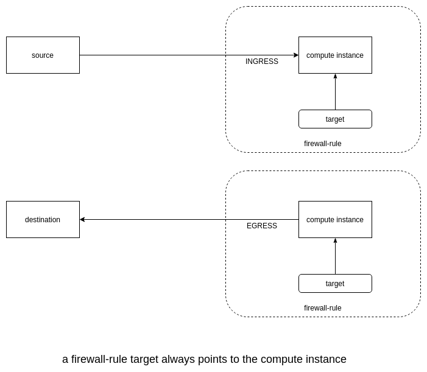

## Networks

#### Create a new network
```
gcloud compute networks create labnet --subnet-mode=custom
```

#### Create a subnet
```
gcloud compute networks subnets create labnet-sub \
   --network labnet \
   --region us-central1 \
   --range 10.0.0.0/28
```

#### List the networks
```
gcloud compute networks list
```

#### Describe a network
```
gcloud compute networks describe NETWORK_NAME
```

#### List subnets
```
gcloud compute networks subnets list
```

#### Create firewall rules


```
gcloud compute firewall-rules create labnet-allow-internal \
	--network=labnet \
	--action=ALLOW \
	--rules=icmp,tcp:22 \
	--source-ranges=0.0.0.0/0
```

#### Other examples
```
gcloud compute networks create managementnet --project=qwiklabs-gcp-03-de8e6230f009 --subnet-mode=custom --bgp-routing-mode=regional

gcloud compute networks subnets create managementsubnet-us --project=qwiklabs-gcp-03-de8e6230f009 --range=10.130.0.0/20 --network=managementnet --region=us-central1
```

```
gcloud compute firewall-rules create privatenet-allow-icmp-ssh-rdp --direction=INGRESS --priority=1000 --network=privatenet --action=ALLOW --rules=icmp,tcp:22,tcp:3389 --source-ranges=0.0.0.0/0

```
## VPC Peering
Google Cloud Platform (GCP) Virtual Private Cloud (VPC) Network Peering allows private connectivity across two VPC networks regardless of whether or not they belong to the same project or the same organization.

#### Create custom network
```
gcloud compute networks create network-a --subnet-mode custom
```

#### Create subnet
```
gcloud compute networks subnets create network-a-central --network network-a \
    --range 10.0.0.0/16 --region us-central1
```
#### Create VM instance
```
gcloud compute instances create vm-a --zone us-central1-a --network network-a --subnet network-a-central
```

#### Enable SSH and ICMP
```
gcloud compute firewall-rules create network-a-fw --network network-a --allow tcp:22,icmp
```

#### Do the same thing on the other VPC
```
gcloud compute networks create network-b --subnet-mode custom

gcloud compute networks subnets create network-b-central --network network-b \
    --range 10.8.0.0/16 --region us-central1

gcloud compute instances create vm-b --zone us-central1-a --network network-b --subnet network-b-central

gcloud compute firewall-rules create network-b-fw --network network-b --allow tcp:22,icmp
```

#### Establish peering

Project-A

Go to the VPC Network Peering in the Google Cloud Platform Console by navigating to the Networking section and clicking VPC Network > VPC network peering in the left menu. Once you're there:

- Click Create connection.
- Click Continue.
- Type "peer-ab" as the Name for this side of the connection.
- Under Your VPC network, select the network you want to peer (network-a).
- Set the Peered VPC network radio buttons to In another project.
- Paste in the Project ID of the second project.
- Type in the VPC network name of the other network (network-b).
- Click Create.


At this point, the peering state remains INACTIVE because there is no matching configuration in network-b in project-B.

Set up network peering on the other project.

#### Check route table
```
student_01_469aaf8526a4@cloudshell:~ (qwiklabs-gcp-01-ad572a9b433d)$ gcloud compute routes list --project qwiklabs-gcp-01-32421a26dc9c
NAME                            NETWORK    DEST_RANGE     NEXT_HOP                  PRIORITY
default-route-0191cb759453b6c3  default    10.140.0.0/20  default                   0
default-route-0e00ebf70aad4ab3  default    10.166.0.0/20  default                   0
default-route-0efc8e71c1276778  default    10.146.0.0/20  default                   0
default-route-0fcb80cc4fb5614c  default    10.162.0.0/20  default                   0
default-route-126a5aa193766745  network-a  10.0.0.0/16    network-a                 0
default-route-23412fd3d6d293a0  default    10.170.0.0/20  default                   0
default-route-2dbae3ec2a44fc65  default    10.138.0.0/20  default                   0
default-route-39083dcf1e6e31fc  default    10.172.0.0/20  default                   0
default-route-3faa4c18412a4ddf  default    10.180.0.0/20  default                   0
default-route-63649d7c047de546  default    10.160.0.0/20  default                   0
default-route-67962c81e40561dc  default    10.168.0.0/20  default                   0
default-route-6cd928b2b2908a89  default    10.178.0.0/20  default                   0
default-route-72cc84452b82c8af  default    10.152.0.0/20  default                   0
default-route-790fefa2d0bc851a  network-a  0.0.0.0/0      default-internet-gateway  1000
default-route-826efabc01bd303d  default    10.132.0.0/20  default                   0
default-route-9049ce419e68b8e4  default    10.154.0.0/20  default                   0
default-route-97c0a29afe9c9078  default    10.150.0.0/20  default                   0
default-route-a14ddac62a33dcf1  default    10.184.0.0/20  default                   0
default-route-a2cee690ba506bda  default    10.128.0.0/20  default                   0
default-route-b49a49632b4c9dd0  default    10.174.0.0/20  default                   0
default-route-c6129e25c584c4aa  default    10.142.0.0/20  default                   0
default-route-caa38e8772288c5f  default    10.182.0.0/20  default                   0
default-route-d1dd3321d54e35fe  default    10.158.0.0/20  default                   0
default-route-d327acb32fe9dfd4  default    0.0.0.0/0      default-internet-gateway  1000
default-route-da878d1210d3d502  default    10.148.0.0/20  default                   0
default-route-df9c400facfb432e  default    10.156.0.0/20  default                   0
default-route-e774ea90f3f076ca  default    10.164.0.0/20  default                   0
peering-route-62f531ee074919a2  network-a  10.8.0.0/16    peer-ab                   0

student_01_469aaf8526a4@cloudshell:~ (qwiklabs-gcp-01-ad572a9b433d)$ gcloud compute routes list --project qwiklabs-gcp-01-ad572a9b433d
NAME                            NETWORK    DEST_RANGE     NEXT_HOP                  PRIORITY
default-route-0481ffe3d4300f87  default    10.146.0.0/20  default                   0
default-route-10b0696de6c885b5  default    10.154.0.0/20  default                   0
default-route-17152b980e9752f6  default    10.164.0.0/20  default                   0
default-route-1b5848459e28fa6c  default    10.162.0.0/20  default                   0
default-route-27108ca6a3406bf8  default    10.138.0.0/20  default                   0
default-route-2766ac37bc8eff5d  default    10.152.0.0/20  default                   0
default-route-2e56194d0df88c97  default    10.178.0.0/20  default                   0
default-route-305a748362c321c3  default    10.160.0.0/20  default                   0
default-route-44984a5c7c593753  default    10.166.0.0/20  default                   0
default-route-459c78153f36d508  default    10.156.0.0/20  default                   0
default-route-462b31ac6c96e3cd  default    10.148.0.0/20  default                   0
default-route-574e54180634bd46  default    10.182.0.0/20  default                   0
default-route-57d5b9d1608e4050  default    10.140.0.0/20  default                   0
default-route-6bb3f8ba8e2b0979  default    10.150.0.0/20  default                   0
default-route-7a1a07883d4df14c  default    10.184.0.0/20  default                   0
default-route-7b839db50dabf02d  default    10.168.0.0/20  default                   0
default-route-7f1e3b108d722925  default    0.0.0.0/0      default-internet-gateway  1000
default-route-81d191206e62f6ca  default    10.172.0.0/20  default                   0
default-route-8f5223858c76307d  default    10.170.0.0/20  default                   0
default-route-a5aa6c2781a22a98  network-b  0.0.0.0/0      default-internet-gateway  1000
default-route-a96388bf87576ab3  network-b  10.8.0.0/16    network-b                 0
default-route-acf4f8c6ad975231  default    10.128.0.0/20  default                   0
default-route-c06de053c0e2db1f  default    10.142.0.0/20  default                   0
default-route-c28bc62de77046a3  default    10.132.0.0/20  default                   0
default-route-c95ad4d7eae01a88  default    10.174.0.0/20  default                   0
default-route-c962773dd98fcedf  default    10.158.0.0/20  default                   0
default-route-db653ce9b0e70d0b  default    10.180.0.0/20  default                   0
peering-route-97148565b668d5a5  network-b  10.0.0.0/16    peer-ba                   0
```

## HTTP Load Balancer with Cloud Armor

GCP HTTP(S) load balancing is implemented at the edge of Google's network in Google's points of presence (POP) around the world. User traffic directed to an HTTP(S) load balancer enters the POP closest to the user and is then load balanced over Google's global network to the closest backend that has sufficient capacity available.

Cloud Armor IP blacklists/whitelists enable you to restrict or allow access to your HTTP(S) load balancer at the edge of the Google Cloud, as close as possible to the user and to malicious traffic. This prevents malicious users or traffic from consuming resources or entering your virtual private cloud (VPC) networks.

