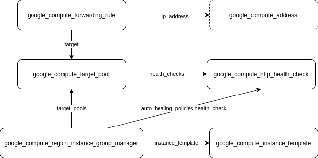
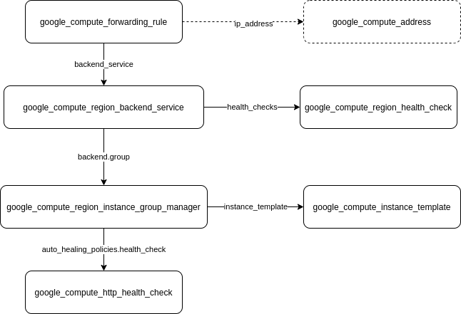
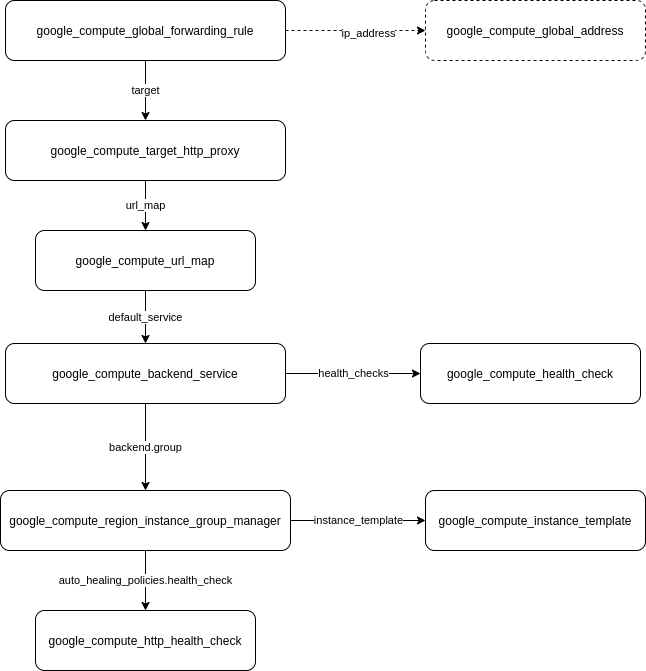

## Load Balancing Exercises With Managed Instance Groups

### 1. External network load balancer pointing to a target pool

[nlb_with_targetpool.tf](ext-nlb-targetpool/nlb_with_targetpool.tf)   
   
note: in this setup, I was using the default network, hence there's no need to create a separate firewall rule. The external address can be assigned dynamically by default, or can also be generated and referenced specifically by the forwarding_rule. It's also worth noting that the compute engine instances behind the target pool does not need to have external IP address assigned to them.
   
   

### 2. External network load balancer pointing to a backend service

[nlb_with_backend_svc.tf](ext-nlb-backendsvc/nlb_with_backend_svc.tf)   
   
   
   
   
### 3. External global http load balancer pointing to multiple managed instance groups

[external_http_lb.tf](ext-http-lb/external_http_lb.tf)   
   
note: use geopeeker.com against the global forwarding rule IP address to see how GCP chose the closest region to serve the HTTP request.
