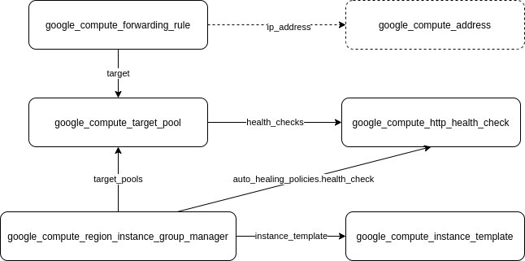

## Load Balancing Exercises With Managed Instance Groups

### 1. External network load balancer pointing to a target pool

[nlb_with_targetpool.tf](nlb_with_targetpool.tf)   
   
note: in this setup, I was using the default network, hence there's no need to create a separate firewall rule. The external address can be assigned dynamically by default, or can also be generated and referenced specifically by the forwarding_rule.

